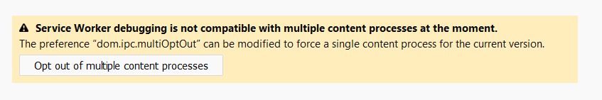

### Introduction

- SSE is implemented using HTML5 API's "Shared Worker" & "Server-Sent Events - One Way Messaging".

- It opens a uni-directional persistent connection from server to client.

- Server-Sent Events allow a web page to get updates from a server.

- A server-sent event is when a web page automatically gets updates from a server.

- This was also possible before, but the web page would have to ask if any updates were available. With server-sent events, the updates come automatically.

- Localforage support is also available(to save data in local storage or IndexedDB or WebSQL). The store name is "SSE_DB".

- Examples: Facebook/Twitter updates, stock price updates, news feeds, sport results, etc.


### Techstack

- Node
- EventSource API(SSE)
- Shared Worker
- Webpack
- AJAX (AJAX Config utility has been used for the ajax call) - Removed 
- localforage (https://github.com/localForage/localForage) 

## Features
- To get the updates from the server without refreshing the page or triggering AJAX call.
- A Single connection is created between the server and the client.
- The data is shared among the opened tabs of the same browser.
- Fallback mechanism is present for the unsupported browsers.
- For the browser that supports Shared Worker & SEE, a single connection will be created b/w client   and server.
- For the browser that doesn't support Shared Worker, only SSE will be used and for each tab, a           separate connection will be created. eg. 4 tabs mean 4 separate connections.
- If the connection is closed either by the client or server, then on refreshing a browser tab or        opening the application in another tab will create a new SSE connection and the updates will be        synced across the opened tabs.
- If the connection is closed by the server or lost due to internet connectivity, new SSE connection     will be retried max of 5 times(by default) at an interval of 5 sec(by default).    

## Browser support 
- https://caniuse.com/#search=sharedworker
- https://caniuse.com/#feat=eventsource

## Limitations
- In Firefox, shared workers cannot be shared between documents loaded in private and non-private windows


- Shared worker is creating more than one connection, when more than one tab is opened(one connection per   tab), in Firefox Quantum- https://stackoverflow.com/questions/47414543/firefox-quantum-sharedworker-not-work



## How to use

- Include the sseSDK file in the project eg: <script src="./gen/j/sseSdk.js"></script>
- Dist folder contains the minified files & Gen folder constains the unminified files.
```sh
let sseURL='http://localhost:8010/stream',
    withCredentials=false,
    workerURL="./gen/j/sharedWorker.js",
    retryTimes=2, //no of times to retry to create SSE connection
    reconnectTime=1000*10; //seconds;
```                

-   sseURL :- specify the URL of the page sending the updates  
-   withCredentials :- true if cookies need to be passed in HTTP request., default- false
-   workerURL :- Shared worker file path, by default the url would be
```sh
<domain>/sharedWorker.js
```
-   retryTimes:- no of times to retry to create SSE connection, default value is 5
-   reconnectTime:- retry to create connection after the provided time, default value is 5000(5 sec)

- Create the Object of SSE and add the custom handler to it using addEventListenerSse function. 
- "pageAction" is the event name which should be coming from the backend along with the data.
```sh
function(e){
        if(e.data=="openModal"){
            $('#myModal').modal('show');
        }
    }
```
-    Code which will be executed once the event is received.

- To close the connection
```sh
    sse.closeConnection();
```
-   Final code
```sh
    <script src="./dist/j/sseSdk.js"></script>
    let sse=SSE(sseURL, workerURL, withCredentials, retryTimes, reconnectTime);
    sse.addEventListenerSse('pageAction',function(e){
                    if(e.data=="openModal"){
                        $('#myModal').modal('show');
                    }
                })
```

## Build and Run
- Build the code in development environment
```sh
npm run dev 
```

- Build the code in prod environment
```sh
npm run prod
```

##Demo
- Open two cmd and run the below commands in each cmd.
- Start the server
```sh
npm run start 
```

- Start the client
```sh
http-server
```
- Open the below URLs in the browser
```sh
 http://localhost:8080/
 http://localhost:8080/sharedWorker_1.html
 http://localhost:8080/sharedWorker_2.html
```
- Check the server's cmd, only one connection must be created. This shows that irrespective of any       number of tabs opened, only one connection is created.                    

### TODO
- Disconnect unused ports created in case of Shared worker.- Done
- On refresh close the existing ports in case of Shared worker. -Done
- Credentials=true configuration -Done 
- Polyfill for IE & Edge -Done
- Test cases 
- Test on all the browsers - IE, Edge, FF, Chrome -Done
- Refer to the AJAX Config file once it is available in the naukri-ui-dev. -Not Required

- SDK:-
- notification messageType, messageContent
- page action - refresh  -Done
- chat message -IM
- local storage -Done